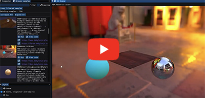

# BabylonCpp - A port of Babylon.js to C++

 [Babylon.js](http://www.babylonjs.com) is a complete JavaScript framework for building 3D games with HTML 5 and WebGL. BabylonJS was chosen because it is the most efficient, most feature-rich, and most modern WebGL graphics library available.

The goal of BabylonCpp is to fully implement the relevant portions of the excellent Babylon.js 3D framework/engine in C++17, facilitating the creation of lightweight, cross-platform 3D games and applications with native performance.

It includes more than 200 examples, a graphical inspector for all 3D objects (based on [ImGui](https://github.com/ocornut/imgui)), as well as an interactive playground for live coding and experiments.

[](https://www.youtube.com/watch?v=o05_5Wyzv54 "BabylonCpp")


# Get the Sources

This repository contains submodules for some of the external dependencies, so when doing a fresh clone you need to clone recursively:

```
git clone --recursive https://github.com/samdauwe/BabylonCpp.git
```

Existing repositories can be updated manually:

```
git submodule init
git submodule update
```

# Build BabylonCpp from Source

A build script named `cmake_build.py` is provided for compiling all sources from command line on Linux and Windows:

Release build:

```
python cmake_build.py all --mode=release
```

Debug build:

```
python cmake_build.py all --mode=debug
```

##  Linux /  OSX

[](https://travis-ci.org/samdauwe/BabylonCpp)

Use the provided CMakeLists.txt with [CMake](https://cmake.org) to generate a build configuration for your favorite IDE or compiler.

##  Windows

[](https://ci.appveyor.com/project/samdauwe/babyloncpp)

A Visual Studio solution file can be generated by using the provided `cmake_build.py` script:

```
python cmake_build.py configure
```

If you're using a different IDE or compiler you can use the provided CMakeLists.txt for use with [CMake](https://cmake.org) to generate a build configuration for your toolchain.

# Sample code

The following code initializes a basic scene by creating a camera, a light, and two basic meshes (a sphere and a ground plane).

```c++

void initializeScene(ICanvas* canvas, Scene* scene)
{
  // Create a FreeCamera, and set its position to (x:0, y:5, z:-10)
  auto camera = FreeCamera::New("camera1", Vector3(0, 5, -10), scene);

  // Target the camera to the scene origin
  camera->setTarget(Vector3::Zero());

  // Attach the camera to the canvas
  camera->attachControl(canvas, true);

  // Create a basic light, aiming 0,1,0 - meaning, to the sky
  auto light = HemisphericLight::New("light1", Vector3(0, 1, 0), scene);

  // Default intensity is 1. Let's dim the light a small amount
  light->intensity = 0.7f;

  // Create a built-in "sphere" shape; its constructor takes 4 params: name,
  // subdivs, size, scene
  auto sphere = Mesh::CreateSphere("sphere1", 32, 2.f, scene);

  // Move the sphere upward 1/2 of its height
  sphere->position().y = 1.f;

  // Create a built-in "ground" shape.
  // Params: name, width, depth, subdivs, scene
  Mesh::CreateGround("ground1", 6, 6, 2, scene);
}

```

This code results in the following scene:


# Examples
Example scenes can be found on the [samples](https://github.com/samdauwe/BabylonCpp/tree/master/src/Samples) page.

# Status
The master branch code is in sync with the last [Babylon.js v4.1.0](https://doc.babylonjs.com/whats-new) release of 2020/02/27.

The [example scenes](https://github.com/samdauwe/BabylonCpp/tree/master/src/Samples) give a good overview which features are currenlty ported and working for [Babylon.js 4.0.0](https://doc.babylonjs.com/whats-new).

Known issues are summarized [here](https://github.com/samdauwe/BabylonCpp/issues).

A summary of the development roadmap can be found on [this page](https://github.com/samdauwe/BabylonCpp/wiki/Roadmap).

# Dependencies

## System ##
* [CMake](https://cmake.org) (>= 3.9)
* [Python](https://www.python.org) (>= 2.7) for the `cmake_build.py` build script

## Available as git submodules ##
* [Earcut](https://github.com/mapbox/earcut.hpp.git): A C++ port of earcut.js, a fast, header-only polygon triangulation library.
* [GLFW](https://github.com/glfw/glfw): Framework for OpenGL application development, used for the examples.
* [Google Test](https://github.com/google/googletest): Google's framework for writing C++ tests on a variety of platforms, used for the unit tests.
* [Dear ImGui](https://github.com/ocornut/imgui): Bloat-free Immediate Mode Graphical User interface for C++ with minimal dependencies.
* [ImGuiColorTextEdit](https://github.com/BalazsJako/ImGuiColorTextEdit):Syntax highlighting text editor for ImGui.
* [JSON for Modern C++](https://github.com/nlohmann/json)
* [Runtime Compiled C++](https://github.com/RuntimeCompiledCPlusPlus/RuntimeCompiledCPlusPlus.git): Library that enables to reliably make major changes to your C++ code at runtime and see the results immediately.

## Supported Compilers ##
The compiler should implement all the features of the [ISO C++ 2017 standard](https://www.iso.org/standard/68564.html):
* GCC >= 7.0.0
* Clang >= 5.0.0
* AppleClang >= 10.0
* MSVC >= 2017

# Supported Operating Platforms #
* Linux
* MacOSX
* Windows >= 7

Graphics APIs:
*   2.1 through 4.6, core profile functionality and modern extensions

# License
Open-source under [Apache 2.0 license](http://www.tldrlegal.com/license/apache-license-2.0-%28apache-2.0%29).
